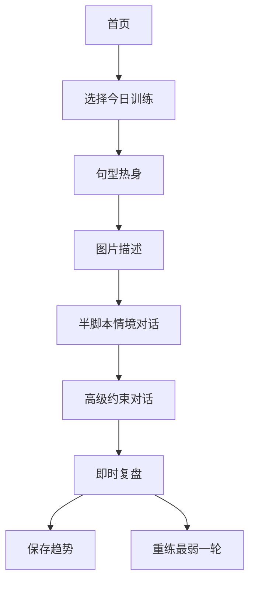
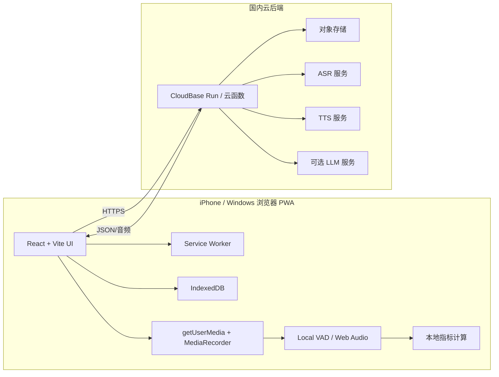

# 个人英语口语练习 PWA 设计研究报告

## 执行摘要

对你这种 **读、写、听基础较强，但口头输出自动化不足** 的学习者来说，产品核心不应是“做一个泛聊天 AI”，而应是把口语训练拆成可重复的、限时的、可计量的任务：**句型启动、图片描述、半脚本情境对话、带约束的高阶论证对话**，并围绕 **speed、breakdown、repair** 三类流利度维度建立长期趋势。二语口语流利度研究通常也正是沿着 speech rate、articulation rate、mean length of run、停顿与修补行为来定义和测量流利度。citeturn27search17turn27search5turn27search10turn27search18

从实现角度看，**先做网页 App / PWA** 是最稳妥路线：PWA 可以通过 iPhone 的 Safari 安装到主屏，Service Worker 负责离线缓存，IndexedDB 负责本地持久化，`getUserMedia` 与 `MediaRecorder` 可以完成麦克风采集与录音；这些能力都属于现代 Web 的标准路径，而 iOS 对主屏 Web App 也提供了独立显示模式。citeturn10search0turn12search4turn12search2turn10search3turn11search1

在中国互联网环境下，**最现实的 MVP 架构** 是：前端用 **React + TypeScript + Vite + vite-plugin-pwa**，部署到 **腾讯云 CloudBase 静态网站托管**；后端用 **CloudBase Run / 云函数** 做 API 代理、鉴权、可选音频转码；语音识别与语音合成优先选 **腾讯云、科大讯飞、阿里云** 这类中国大陆可稳定访问的服务；如果后面再上 LLM，则把它放在“对话生成器 / 评价器 / 任务编排器”的位置，而不是让它抢走整个产品逻辑。CloudBase 官方文档已经直接支持 React、Vue、Vite 等前端项目部署；如果你把服务落在中国内地并绑自定义域名，则通常需要 ICP 备案。citeturn22search1turn22search6turn22search8turn22search4turn21search0turn21search1turn21search6turn21search11

就语音路线而言，**不带 LLM 的 MVP 完全可做**。依赖 ASR 时间戳、Web Audio/VAD、本地规则与有限状态机，你已经可以实现：流利度指标、沉默/填充词检测、30 秒到 1 分钟图片描述任务、半脚本对话引擎、句型启动操练，以及部分高级约束对话。LLM 的价值不在“让它陪你聊天”，而在于让 NPC 更自然、反馈更细、情境更丰富。citeturn27search18turn27search17turn26search1turn26search0

综合成本、可达性与开发复杂度，我给你的首推组合是：

| 维度 | 建议 |
|---|---|
| 产品定位 | **任务型口语训练器**，不是通用聊天机器人 |
| 前端 | **React + TS + Vite + vite-plugin-pwa** citeturn24search0turn24search1turn24search6 |
| 部署 | **CloudBase 静态托管 + CloudBase Run/云函数** citeturn22search1turn22search4turn22search8 |
| 语音 | **腾讯云一栈**，或 **讯飞 ASR + 腾讯/阿里 TTS** 做 A/B 测试 citeturn38search0turn39search0turn37search1turn37search3turn28view0 |
| LLM 可选项 | **DeepSeek / 智谱 / 百度千帆 / 腾讯混元 / 阿里百炼**，统一走后端代理 citeturn29view3turn32search1turn33view2turn28view1turn30search9 |
| MVP 边界 | 不做发音评分、不做社交、不做 App Store 原生上架、不做实时双向 voice-to-voice |

## 前提假设与定位

### 本报告采用的未明确假设

你没有显式给出预算上限、网络时延容忍度、是否愿意备案、是否希望完全离线运行、每天练习时长等信息。为了做出可执行方案，我采用了下面这些工程假设：

| 假设 | 本报告采用值 | 含义 |
|---|---|---|
| 月预算 | **尽量接近 0，最好控制在几十元以内** | 符合个人练习、非商业项目 |
| 延迟容忍 | **MVP 接受“录完再出结果”或 1–5 秒级回看反馈** | 不把“实时同声交互”作为首要目标 |
| 用户数量 | **单用户** | 不做多租户、鉴权、支付、配额系统 |
| 训练时长 | **单次 10–20 分钟** | 以可坚持为目标，而不是“重型学习平台” |
| 部署目标 | **中国大陆可访问，iPhone 可安装为 PWA** | 优先国内云服务与 HTTPS |
| 隐私策略 | **本地优先，云端最小必要上传** | 音频/文本尽量默认本地保存 |

这些假设会直接影响架构和功能边界。如果其中某一项与你真实偏好不符，例如你愿意接受更高月费换取更自然的实时语音对话，那么后续设计可以再上调。  

### 训练定位

对你的用户画像，更合理的训练目标不是“像口语考试那样给一个总分”，而是把 **“想法组织 → 句子启动 → 连续输出 → 逻辑展开”** 变成高频动作。研究中对二语口语流利度的常见操作化，本来就强调 **速度 fluency、停顿/卡顿 fluency、修补 fluency** 三类；其中 speech rate、articulation rate、mean length of run、silent/filled pauses 和 self-repair 都是最常见指标。换句话说，**你最先需要的是“更顺地说出来”**，而不是“更像美音地发出来”。citeturn27search17turn27search5turn27search10turn27search18

这也解释了为什么你明确提出“**不要 pronunciation scoring**”是合理的。对高输入、低输出型学习者，先盯住 **停顿、卡壳、反复重启、句式贫乏**，往往比做音位级打分更符合收益/复杂度比。尤其是研究还显示，**句内停顿的位置** 对听者主观流利感影响很大，句内频繁长停顿比句间停顿更伤流利感。你的产品因此应该重点识别“我是不是总在句子中间断掉”。citeturn13search12turn27search17

### 设计原则

你的 App 最重要的设计原则，我建议定为下面三条：

第一，**把自由口语缩减为有边界的任务口语**。泛聊很容易滑向“想法很多、嘴还是出不来”；而句型启动、图片描述、半脚本场景和带约束辩论更容易形成可重复的训练闭环。这个方向与自动流利度评估实践中常见的 timed monologue、picture description、structured speaking tasks 是一致的。citeturn27search18turn27search6

第二，**用自己的历史表现做基线，而不是一开始追求绝对标准化评分**。不同人的 L1 说话风格、任务类型、对话/独白模式都会影响 fluency 指标，所以对个人练习软件来说，最有价值的不是“你是 73 分”，而是“你最近两周的 pause ratio 在下降、mean length of run 在上升”。citeturn27search13turn27search9turn27search12

第三，**让规则引擎先于 LLM 存在**。只要你先把任务、状态、约束、评分钩子做成可编排对象，LLM 后面加不加都不伤骨架；反过来，如果一开始就把核心逻辑外包给一个大模型，你会很快失去边界、成本与可解释性。这个原则对个人开发者尤其重要。  

## 产品范围与边界

### 你真正要做的产品

你的产品不是“英语聊天 App”，而是一个 **面向单人自练的口语输出锻炼器**。首页不需要显得像社交产品，而应该像一个训练台：今天的训练卡片、今天的目标时长、最近 7 天趋势、以及一个进入任务的主按钮。

我建议把核心模块收敛成五个：

| 模块 | 针对的痛点 | 交互形式 | MVP 反馈方式 |
|---|---|---|---|
| 句型构造操练 | 开口启动慢，句式单一 | 给一个 starter，例如 “one possible explanation is…”；限时 10–20 秒开口完成 | starter 命中、长度、停顿、填充词、是否说满 |
| 图片描述 | 能说词，但不擅长连续组织输出 | 30 秒、45 秒、60 秒三档图片描述 | overview 是否出现、细节覆盖数、停顿比、重复比 |
| 半脚本情境对话 | 真实场景中容易短答、无法推进 | 有脚手架的 4–6 轮对话，如点咖啡、会议、问路、项目讨论 | slot 是否补全、回应时长、任务是否推进 |
| 高级约束对话 | 会说简单句，但不会让步、比较、论证 | 给立场卡 + 约束，例如“本轮必须用一个 concession 和一个 comparison” | 约束命中、逻辑连接词命中、卡壳位置 |
| 复盘与趋势 | 练了很多但没有“进步感” | 每次训练后出局部反馈；周视图出趋势 | 个人基线对比、最佳表现、建议重练任务 |

围绕流利度测量研究，speech rate、articulation rate、mean length of run、停顿频次与修补行为都是可以稳定落地到这五个模块里的；其中图片描述和限时独白尤其适合你这种“有内容、但输出自动化不足”的练习目标。citeturn27search5turn27search10turn27search18

### 建议的用户流



这个流程有一个关键优点：**先从“低生成负担”任务起步，再进“高生成负担”任务**。你不需要第一次就进入开放辩论；先用句型 starter 热身，再进入图像与情境，最后做高约束输出，心理阻力会小很多。  

### 示例界面草图

下面这个草图故意采用“训练器”而不是“聊天器”的信息布局：

```text
┌──────────────────────────────────────┐
│ 今日训练                              │
│ 连续 7 天 · 本周目标 60 分钟          │
├──────────────────────────────────────┤
│ 模块：图片描述 45s                    │
│ [           题图区域           ]      │
│ 目标：先总述，再说3个细节，再做1个推断 │
│ 必须尝试：in the foreground / maybe   │
│                                      │
│ 00:45                                │
│ [ 开始录音 ]   [ 换一张图 ]           │
├──────────────────────────────────────┤
│ 上次表现                              │
│ Speech rate  ↑  Pause ratio ↓        │
│ Filler ratio  =  Mean length of run ↑ │
└──────────────────────────────────────┘
```

```text
┌──────────────────────────────────────┐
│ 复盘                                  │
├──────────────────────────────────────┤
│ 任务完成度： 4 / 5                    │
│ Starter 命中：yes                     │
│ 长停顿（>700ms）：3 次                │
│ 填充词：2 次                          │
│ 推荐重练：第二轮第 18–24 秒           │
│ 你的更优版本模板：                     │
│ "One possible explanation is that..." │
│ [ 立即重练 ]   [ 保存并继续 ]          │
└──────────────────────────────────────┘
```

### 明确不做的东西

为了让一个没有软件背景的个人开发者真的落地，我建议你前两个月**明确不做**这些内容：

你先不要做发音评分、音标可视化、音素级纠错。Web 端做这件事要么效果不稳，要么实现成本极高，而且与你当前痛点不匹配。  

你先不要做开放式语音电话般的“实时 voice-to-voice”。虽然国内多家云厂商都给出 WebSocket 实时 ASR/TTS 能力，但双向流式编排、回声处理、状态同步、弱网恢复、iPhone WebKit 兼容，会把项目复杂度迅速拉高。对你的个人训练用途而言，“录一轮、立即反馈、一键重练”更划算。citeturn36search8turn37search3turn28view0

你也先不要做用户系统、排行榜、课程商城、教师批改。你只有一个主要用户，就是你自己。  

## 技术架构与部署

### 推荐架构

从工程复杂度与中国可访问性综合考虑，我建议你采用下面这套 **本地优先、云端增强** 的混合架构：



Web 端采音的标准能力链条是：`getUserMedia` 负责麦克风权限与音频流获取，`MediaRecorder` 负责录音 Blob，Service Worker 负责离线资源缓存，IndexedDB 负责较大对象和结构化数据持久化；如果你要做本地能量条、波形、简易静音检测，则用 Web Audio API，必要时再用 AudioWorklet 把音频分析从主线程挪开。所有这些都要求 HTTPS 或本地 `localhost` 级开发环境。citeturn12search4turn12search2turn10search0turn10search3turn12search7

### 本地与云端的职责划分

这套产品最怕的是“任何动作都要上云”，那会让交互发飘、成本上升、离线能力消失。更合理的职责划分是下面这样：

| 放在本地 | 原因 | 放在云端 | 原因 |
|---|---|---|---|
| 任务 UI、计时器、波形、按键、缓存 | 必须低延迟 | ASR | 英语口语识别质量更稳 |
| VAD、静音检测、停顿计算 | 可直接读音频帧 | TTS | 音色与自然度更好 |
| 录音文件、转写结果、局部统计、趋势 | 个人数据，本地优先 | LLM 可选评价 | 只在需要 richer 反馈时调用 |
| 任务包和图片素材缓存 | 保证离线可练 | 可选云备份/导出 | 仅做同步，不做核心链路 |

对于你的目标，**本地离线至少可以做到**：打开 App、加载题库、做定时任务、录音、回放、查看历史、做简单停顿/填充词检测。真正需要云端的，是更强的 ASR/TTS/LLM，而不是整个产品本体。Service Worker 与 IndexedDB 正适合这种 offline-first 设计。citeturn11search0turn10search3turn10search1

### 国内部署方案对比

| 方案 | 前端部署 | 后端能力 | 优点 | 缺点 | 适合你吗 |
|---|---|---|---|---|---|
| **腾讯云 CloudBase** | 静态网站托管支持源码部署与 Vite/React 项目；可配合云托管/云函数 citeturn22search1turn22search6turn22search8turn22search4 | CloudBase Run 自动扩缩容，适合代理 API、音频处理 citeturn22search4turn22search5 | 一体化、对新手友好、适合 Web App/PWA | 深度可控性不如自己拼基础设施 | **最推荐** |
| **阿里云 OSS + 函数计算 FC** | OSS 可静态托管 HTML/CSS/JS；FC 可快速挂 Web 应用 citeturn21search6turn23search1turn23search4 | Web 函数方式明确，适合 API 代理与轻量服务 citeturn23search1turn23search5 | 稳定、文档完善、后续扩展性好 | 配置感稍强 | **第二推荐** |

如果你选择中国内地节点并且想绑定自定义域名，阿里云与腾讯云都明确说明：**网站或 App 指向中国内地服务器时需要依法备案**；阿里云也明确写出，若资源部署在中国香港或海外节点则无需备案。对于个人练习项目，最省心的路径通常是：**先不折腾自定义域名**，先让产品跑起来；等功能稳定后，再决定是否走备案。citeturn21search0turn21search1turn21search11turn21search12

### iPhone 作为 PWA 的现实边界

PWA 在 iPhone 上是可行的，但要接受它是“Web App”，不是“原生 iOS App”。web.dev 的 iOS 指南明确提到，用户通过 Safari 的分享菜单“添加到主屏幕”后，Web App 会以主屏方式运行；在 iOS 上，主屏 Web App 目前只支持 `display: standalone`。这对你足够，因为你要的是一个个人练习入口，而不是 App Store 发布链路。citeturn11search1

如果后面你想加“提醒我今天该练口语了”这类能力，iOS 主屏 Web App 也已经支持 Web Push，但这是第二阶段需求，不该进入 MVP。citeturn9search2turn9search20

## 语音与大模型选型

### 中国可用语音技术对比

下面这张表按你最关心的几个维度来比较：**能不能在中国用、便不便宜、Web/iOS 友不友好、适不适合个人 PWA**。需要先说明一点：各家官方文档很少公布统一的“英文口语 WER 基准”，所以我把“准确性”列处理成 **英文支持、动态修正、热词、自训练、时间戳、流式能力** 这些更可操作的代理信号。

| 方案 | API / 协议 | 免费 / 试用 | 延迟形态 | 准确性代理信号 | Web / iOS 支持 | 前端直连 / 中国大陆适配 | 结论 |
|---|---|---|---|---|---|---|---|
| **腾讯云 ASR/TTS** | ASR 有实时 WebSocket；官方写明提供 **服务端、客户端、前端、小程序** SDK/接入；TTS 也有 API 与 SDK 接入路径。citeturn36search8turn7view0turn39search9 | ASR 免费额度：录音文件 10 小时/月、实时 5 小时/月、一句话 5000 次/月；TTS 免费额度按音色分层，通用资源可到 800 万字符，另有 2 万/10 万字符档。citeturn38search0turn39search0turn39search3 | **流式实时** | 官方强调 Transformer、自适应、语言混合、热词、自助训练；支持英语与普粤英识别。citeturn38search8turn38search7 | 对 Web/PWA 友好，且官方前端支持明显。citeturn7view0 | 中国大陆可达性高；可前端接 WebSocket，但生产上仍建议用服务端签名/代理。 | **做“一栈 MVP”的首选** |
| **阿里云智能语音交互 / 百炼语音** | 官方写明提供 **RESTful API、移动端、服务端、微信小程序、WebSocket** 等接入方式；实时语音与实时 TTS 都有 WebSocket 路线。citeturn28view0turn8search6 | 智能语音链路有 **限时 3 个月免费试用**；百炼还有新人免费额度与一次性试用额度规则。citeturn5search1turn30search0turn30search5 | **流式实时 / 异步文件** | 适合先跑通；官方文档强调实时识别与多入口接入。英文口语准确度建议用你自己的样本做 A/B。citeturn28view0turn8search3 | WebSocket + 移动端接入齐全。citeturn28view0 | 大陆访问好；更适合“前端录音、后端代理调用”的稳妥方案。 | **混搭方案的强候选** |
| **科大讯飞** | 语音听写流式 WebAPI；在线语音合成流式 WebSocket API。citeturn37search0turn37search3 | ASR 新用户默认 500 次/日测试量，并可领 **5 万次 / 90 天** 免费包；转写另有 **5 小时**体验包。citeturn37search1turn37search5 | **短时实时 / 流式** | 动态修正免费开放；适合短语音即时转写；支持多语种与多方言。citeturn37search0turn37search4 | 官方快速指引明确支持通过服务页下载 **iOS/Android/Linux SDK** 或获取 WebAPI。citeturn37search10 | TTS 文档明确指出 WebSocket 相比 HTTP API 有“原生支持跨域”的优势；大陆访问友好。citeturn37search3 | **如果你更重视“短句口语起步”与 Web 轻接入，讯飞很合适** |
| **百度智能云语音** | 实时 ASR WebSocket，支持边传边识别并返回句子开始/结束时间；在线 TTS 可在线调用。citeturn36search5turn36search2turn36search10 | ASR 文档说明有免费调用额度并优先扣减；TTS 产品页写明 **企业认证可领 100 千次免费额度**。citeturn36search4turn36search10turn36search1 | **流式实时** | 有句级时间戳、自训练语言模型、短语音极速版；适合做时间对齐与回放定位。citeturn36search5turn36search2 | 有 iOS SDK 路线。citeturn7view3 | 大陆访问好；更推荐后端调用。 | **可做备选或 A/B 对照** |
| **sherpa-onnx** | WebAssembly / JS / Swift / Node，支持离线 ASR/TTS。citeturn26search6turn26search10turn26search21turn26search13 | 开源免费。citeturn26search10turn26search13 | **本地实时 / 近实时** | 不依赖外部网络，适合离线实验。citeturn26search6turn26search21 | 可做 Web 与 iOS 端实验。citeturn26search10turn26search13 | 无 CORS、无跨境 API 依赖；但要下载模型，启动与内存表现需实测。 | **离线第二阶段方案** |
| **Vosk / Vosk-browser + 浏览器 TTS** | Vosk 是离线开源 ASR；Vosk-browser 提供浏览器 WASM 识别；浏览器 `speechSynthesis` 是内置 TTS。citeturn26search11turn26search3turn12search9 | 开源 / 内置免费。citeturn26search11turn26search3turn12search9 | **本地** | Vosk 支持 20+ 语言；浏览器识别能力则不适合作为主路线，因为 `SpeechRecognition` 并非 Baseline。citeturn26search11turn12search5 | Web 最方便；iPhone 要逐机实测。citeturn26search3turn12search9 | 完全本地，不依赖云服务。 | **最低成本原型 / 备用离线模式** |

基于这张表，你可以得出一个很清晰的结论：**如果你要的是“最容易先做成”**，腾讯云和讯飞最友好；**如果你要的是“后续在国内继续扩展而不换栈”**，腾讯云/阿里云更稳；**如果你要的是“完全离线实验”**，就看 sherpa-onnx 或 Vosk。  

### 推荐的语音组合

我更建议你从下面三种组合里选一种，而不是一开始就追全：

**组合 A：全腾讯一栈。**  
CloudBase 托管前端，CloudBase Run/云函数代理，腾讯云 ASR + 腾讯云 TTS，后期如果要上 LLM 再接腾讯混元。优点是账号、账单、文档、网络环境都统一，且腾讯的 ASR/TTS 免费额度对个人开发者相当友好。citeturn22search1turn22search4turn38search0turn39search0

**组合 B：腾讯托管 + 讯飞 ASR + 腾讯/阿里 TTS。**  
如果你重点练的是 **短句开口与即时反应**，讯飞的短时流式听写与动态修正对练习体验很有吸引力；TTS 则继续放在腾讯或阿里，做成“文字回读 + NPC 音频输出”。citeturn37search0turn37search1turn37search3turn28view0turn39search3

**组合 C：本地离线实验版。**  
前端直接内置 `vad-web` 或 Silero VAD 做静音检测，再试 sherpa-onnx/Vosk-browser 做离线 ASR，配合浏览器 `speechSynthesis`。这个组合最省云成本，但更像技术实验，不一定立刻达到你对英文口语识别的体验要求。citeturn26search1turn26search0turn26search6turn26search3turn12search9

### LLM 接入选项与成本特征

如果你后面决定接 LLM，我建议你把它的职责限定为三件事：**生成更自然的 NPC 回复、按任务 rubric 输出 JSON 评价、动态生成下一轮约束**。不要让 LLM 直接充当“整站业务逻辑”。在中国可直接接入、并且比较适合个人开发者的选择，下面几家最有代表性：

| 提供商 | 调用方式 | 免费 / 新手额度 | 价格信号 | 适合你的角色 |
|---|---|---|---|---|
| **腾讯混元** | 官方明确兼容 OpenAI 接口规范。citeturn28view1 | 首次开通后，混元生文与多模态模型共享 **100 万 tokens** 免费调用额度，且 `Hunyuan-lite` 免费使用。citeturn29view0turn29view1 | 例如 Tencent HY 2.0 Instruct 输入 3.18 元 / 百万 tokens，输出 7.95 元 / 百万 tokens。citeturn29view1 | 如果你想走“全腾讯一栈”，用它最省心 |
| **百度千帆** | 官方明确支持 OpenAI SDK 兼容，`base_url` 为千帆地址。citeturn28view2turn33view2 | 新用户会对多种指定模型自动发放 **各 100 万 tokens / 3 个月** 的免费额度。citeturn33view1 | 例如 ERNIE Speed Pro 输入 0.0003 元 / 千 tokens、输出 0.0006 元 / 千 tokens；Qwen3-30B 约 0.00075 / 0.003 元 / 千 tokens。citeturn34view1turn34view2 | 很适合做多模型 A/B 测试平台 |
| **阿里百炼 / Qwen** | 官方平台支持 HTTP/SDK 调用，百炼覆盖文本、图像、音频、视频模型。citeturn30search8turn30search9 | 有新人免费额度，阿里云产品页还写明新用户开通即享 **超 7000 万 Tokens** 体验额度；有效期按模型 30–90 天。citeturn30search1turn30search0 | 如 `qwen-plus` 在低上下文范围下输入 0.8 元 / 百万 tokens，输出 2 元 / 百万 tokens。citeturn28view4 | 想要“高性价比 + 国产主流模型”时很适合 |
| **智谱** | 官方明确提供 OpenAI API 兼容；HTTP Bearer 认证，并建议不要在代码里硬编码 API Key。citeturn32search1turn32search6turn32search9 | 有免费模型，如 `GLM-4.7-Flash`。citeturn31view1turn32search3 | `GLM-4.5` 文档给出价格低至输入 0.8 元 / 百万 tokens，输出 2 元 / 百万 tokens，且强调高速度。citeturn32search0 | 很适合作为结构化评价器或轻量对话生成器 |
| **DeepSeek** | 官方支持 OpenAI / Anthropic 兼容格式。citeturn20search10turn19search1 | 官方文档页未突出 API 免费额度；网页/App 免费不等于 API 免费。citeturn19search0turn20search0 | `deepseek-v4-flash` 非缓存输入 1 元 / 百万 tokens，输出 2 元 / 百万 tokens；缓存命中输入仅 0.02 元 / 百万。citeturn29view3 | **极适合做低成本 JSON 评价器** |

从这些价格你能看出一个重要工程结论：**如果 LLM 仅负责 JSON 反馈与 NPC 文本生成，它的文字成本通常会显著低于 ASR/TTS 成本**。例如按 DeepSeek-V4-Flash 的官方价格，2,000 输入 tokens + 500 输出 tokens 的一次评价，大约只要 **0.003 元** 左右；但语音链路里的 ASR/TTS 往往是按分钟或按千字符结算。也就是说，后期真正让你花钱的，通常不是“模型会不会太贵”，而是“语音用量会不会持续放大”。citeturn29view3turn39search8

### 不要把它做成普通聊天 LLM

如果你接了 LLM，真正的差异化来自 **控制**，不是来自“模型更聪明”：

| 通用聊天 LLM | 你的口语练习 App |
|---|---|
| 自由聊什么都可以 | 每轮都有固定任务目标、时间限制、成功条件 |
| 回答可以很长 | 你应该控制 NPC 回复长度，甚至限制为 1–2 句 |
| 反馈经常泛、不可比 | 你的反馈应该是 rubric + JSON + 历史趋势 |
| 不记课程结构 | 你要有课程图谱、难度递进、重复训练机制 |
| 不关注口语流利度 | 你要把停顿、填充词、starter 命中率、约束命中率前置 |

换句话说，**LLM 是发动机，不是方向盘**。方向盘应该是你的任务状态机、约束系统、评估钩子和课程推进逻辑。  

## 非 LLM 实现与算法

### 流利度指标的可计算形式

如果你能拿到音频时长、VAD 结果和 ASR 文本，最小可用的一组 fluency 指标可以定义为：

设一次口语任务总时长为 \(T\)，VAD 划分出的有声片段为
\[
V = \{[s_i,e_i]\}_{i=1}^{m},
\]
则总发声时长
\[
T_{\text{voice}} = \sum_{i=1}^{m}(e_i-s_i).
\]
总静音时长
\[
T_{\text{pause}} = T - T_{\text{voice}}.
\]

如果 ASR 转写得到词序列
\[
w_1,w_2,\dots,w_N,
\]
那么最核心的几个指标可以写成：

\[
\text{Speech Rate} = \frac{60N}{T}
\]

\[
\text{Articulation Rate} = \frac{60N}{T_{\text{voice}}}
\]

\[
\text{Pause Ratio} = \frac{T_{\text{pause}}}{T}
\]

\[
\text{Mean Length of Run} = \frac{N}{m}
\]

如果把停顿长度记为
\[
p_j = s_{j+1}-e_j,
\]
并定义长停顿阈值 \(\theta\)（例如 700ms），则长停顿频率可写为

\[
\text{Long Pause Rate}_{\theta} = \frac{60 \cdot |\{j: p_j > \theta\}|}{T}.
\]

研究中，二语口语流利度常按 **speed fluency、breakdown fluency、repair fluency** 三类拆分；speech rate、articulation rate、mean length of run、停顿长度与频率、自我修补都是常见指标。citeturn27search17turn27search5turn27search10turn27search18

### 填充词、沉默与修补的检测

你可以不靠 LLM，直接用规则实现这一层：

设填充词集合为
\[
\mathcal{F}=\{\text{uh},\text{um},\text{er},\text{ah},\text{you know},\text{like},\text{emm}\ldots\},
\]
则填充词比例可定义为
\[
\text{Filler Ratio} = \frac{|\{w_i \in \mathcal{F}\}|}{N}.
\]

修补（repair）事件可以由三类规则触发：

\[
\text{Repair Count} = C_{\text{repeat}} + C_{\text{false-start}} + C_{\text{self-correct}}
\]

其中：

- \(C_{\text{repeat}}\)：连续 1–3 gram 在短停顿后重复，例如 “I think… I think…”
- \(C_{\text{false-start}}\)：句子中途放弃并重启，例如 “The main… the main reason is…”
- \(C_{\text{self-correct}}\)：明显改写，如 “on Monday—sorry—on Tuesday”

进而可得
\[
\text{Repair Ratio}=\frac{\text{Repair Count}}{N}.
\]

这套规则并不追求学术评分精度，而是追求 **“对个人训练有解释性”**。你看到“今天 filler ratio 高、长停顿集中在句中”，就已经足够指导重练。关于自动流利度测量，研究文献与自动评估实践也确实把 silent/filled pauses、speech rate、self-corrections 视为核心线索。citeturn27search18turn27search6turn27search17

### 本地 VAD 与音频分析怎么做

如果你想尽量减少对云端的依赖，最适合放到浏览器本地的，就是 **语音活动检测**。你有三档方案：

| 档位 | 做法 | 适用性 |
|---|---|---|
| 最轻量 | 直接用 Web Audio API 的 `AnalyserNode` 做 RMS/能量阈值检测 | 够做“是否在说话”与“长停顿” |
| 中等 | 用 `@ricky0123/vad-web` 这类浏览器 VAD 包 | 更适合 segment 级切分与口语起止检测 citeturn26search1turn26search12 |
| 稍重 | 用 Silero VAD / ONNX 方案 | 更鲁棒，但工程复杂些 citeturn26search0turn26search8 |

如果你的目标只是先做“长停顿、句间停顿、开始说话延迟”，**先用 `AnalyserNode` 或 `vad-web` 就够了**。Silero VAD 更适合以后进入“自动分段上传 ASR”阶段。  

### 各模块在不接 LLM 时的可实现性

#### 句型构造操练

这部分完全可以不用 LLM。任务对象可以设计成：

```yaml
id: starter-001
starter: "one possible explanation is"
goal: "explain why remote work is popular"
prepSeconds: 5
speakSeconds: 20
required:
  - starter_exact_or_fuzzy
  - one_reason
  - one_example_optional
```

规则检测包括：

- `starter_exact_or_fuzzy`：用小写归一化 + 编辑距离或 token 相似度匹配
- `最低长度`：如至少 8 个词
- `完整句`：是否以谓词结束，是否只有短语无句子
- `停顿`：starter 后 1 秒内是否卡住
- `连接词`：是否用了 because / since / for example 等

这比让 LLM 去判断“你有没有说对”更稳，因为任务目标本来就非常确定。  

#### 图片描述任务

30 秒到 1 分钟的图片描述也不必依赖 LLM 生成题目。你只要维护一个本地图片题库，每张图附一个 JSON 元数据即可：

```json
{
  "imageId": "street-014",
  "difficulty": "B1-B2",
  "tags": ["street", "crowd", "rain", "umbrella", "advertisement"],
  "goals": ["overview", "3_details", "1_inference"],
  "recommendedFrames": ["in the foreground", "it seems that", "compared with"]
}
```

系统不需要“理解图片”，只需要知道这张图有哪些标签、该引导用户说哪些维度。反馈时按以下逻辑即可：

- 是否给出总体总述
- 是否覆盖至少 3 个标签
- 是否出现空间/对比/推断类表达
- 是否在 30–60 秒内持续输出
- 是否句中长停顿过多

这样做的最大优点是：**结果稳定、成本接近 0、离线可用**。如果以后再接多模态模型，那是升级，不是前提。  

#### 半脚本情境对话

半脚本情境最适合用 **有限状态机**（FSM）实现。你不需要让系统真正“理解语言深义”，只要让它识别少量意图和 slot：

```yaml
scenario: coffee-order
state: greet
slots:
  drink: null
  size: null
  hot_iced: null
transitions:
  greet:
    npc: "Hi, what can I get for you today?"
    expect: [greet, ask_recommendation, order_drink]
  size:
    npc: "Sure. What size would you like?"
    expect: [size]
  finish:
    npc: "Great. Anything else?"
```

ASR 文本进来之后，用关键词、短语模式、词典匹配就能完成大多数状态转移，例如：

- `small / medium / large`
- `iced / hot`
- `I'd like / can I get / could I have`
- `that's all / nothing else`

你甚至可以设计“容错别名表”，专门适配中国学习者常见表达。对你的使用场景，这比上一个大模型做意图识别更简单、更可控。  

#### 高级约束对话

这是最像“高阶口语训练”的模块，但它仍然可以先做一个 **不依赖 LLM 的简化版**。做法是把高阶能力拆成“必须命中的 discourse markers 与策略”：

```yaml
taskType: constrained-dialogue
topic: "Should universities require internships?"
role: "moderately supportive"
requiredMarkers:
  - concession
  - comparison
  - one_possible_explanation
  - one_example
markerPatterns:
  concession:
    - "to some extent"
    - "I agree that"
    - "that's true, but"
  comparison:
    - "compared with"
    - "in contrast"
    - "whereas"
```

系统的检查目标不再是“你观点是否深刻”，而是：

- 是否完成 **让步**
- 是否给出 **比较**
- 是否说出 **因果/解释句**
- 是否举出 **例子**
- 是否在限定时长内完成这些动作
- 中间是否发生多次重启、卡壳、沉默

这类任务最适合你的目标，因为它迫使你练习 **英语中的组织动作**，而不是只堆词汇。  

### 非 LLM 路线能做到什么，做不到什么

能做到的部分，其实已经很多：

- 基于 ASR 时间戳与本地 VAD 的流利度趋势
- 基于规则的 filler / silence / repair 反馈
- 基于 FSM 的情境对话
- 基于 starter / marker 的句型操练与高阶约束训练
- 基于图片标签的描述任务与难度递进
- 基于个人基线的周趋势与重练推荐

真正做不到、或者说不值得用规则硬做的，是这些：

- 对“内容是不是很有逻辑/很自然”的开放式语义评估
- 对未脚本化复杂对话的高质量即时生成
- 对用户观点深度、礼貌度、情感色彩的细致反馈
- 对 ASR 错误较多文本的高鲁棒性理解

也正因为如此，**非 LLM MVP 是正确起点，LLM 是后续增强层**。  

## MVP 实施计划与路线图

### 技术栈建议

如果只给一个最适合你的技术栈，我的建议是：

| 层 | 建议方案 | 原因 |
|---|---|---|
| 前端框架 | **React + TypeScript + Vite** citeturn24search0turn24search1turn25search2 | React 资料最多，Vite 极快，Codex 生成与修补示例也最多 |
| PWA | **vite-plugin-pwa** citeturn24search6turn24search2 | 针对 Vite 配置少，直接生成 manifest 与 SW |
| 持久化 | **IndexedDB** citeturn10search3 | 适合音频 Blob、任务结果与趋势数据 |
| 录音与音频分析 | **getUserMedia + MediaRecorder + Web Audio API** citeturn12search4turn12search2turn12search7 | 原生 Web 能力，避免多余依赖 |
| 部署 | **CloudBase 静态托管 + CloudBase Run** citeturn22search1turn22search4 | 国内可达、适合个人开发者 |
| 单元测试 | **Vitest** citeturn25search1 | 原生适配 Vite |
| API Mock | **MSW** citeturn25search3turn25search11 | 不接真云服务就能开发 UI |
| E2E 测试 | **Playwright（WebKit）** citeturn25search0turn25search4 | 尽量逼近 iPhone Safari / WebKit |

为什么这里不首推 Vue 或 Svelte？不是因为它们不行，而是因为 **你会用 Codex 辅助开发**。React + Vite + TypeScript 的公开示例、组件模式、PWA 集成与测试生态最成熟，最适合“让 Codex 一步步帮你搭出来”。React 官方中文文档也明确把 Vite 列为推荐构建工具之一。citeturn24search1turn24search17

### 如何把 Codex 纳入你的工作流

OpenAI 官方文档说明，Codex 在 Windows 上可通过 **原生 Codex app、CLI、IDE 扩展** 使用；Codex CLI 能在本地目录里读取、修改和运行代码；IDE quickstart 也给出了扩展安装与开始任务的路径。对于你这种没有传统开发背景、但希望靠“任务驱动式协作开发”推进项目的人，这正合适。citeturn40search16turn40search8turn40search1turn40search6

更重要的是，官方还给出了项目级 `.codex/config.toml` 与用户级配置方式。这意味着你完全可以把这个项目做成“一个小而明确的 Codex 工作区”，让它连续处理前端、状态机、测试与后端代理任务。citeturn40search11

### 推荐的开发顺序

下面这个顺序是我认为**最不容易把你做崩**的路线。它故意把“看得见的东西”放前面，把“最烧脑的接云服务”稍微往后压。

| 阶段 | 目标 | 让 Codex 做什么 |
|---|---|---|
| 壳子阶段 | 跑起一个可安装的 PWA | 建项目、路由、manifest、安装提示、离线缓存 |
| 录音阶段 | 能录、能存、能回放 | 麦克风权限、录音组件、IndexedDB、历史页 |
| 训练阶段 | 先把任务系统做出来 | starter drills、图片描述、计时器、结果页 |
| 指标阶段 | 让产品“像训练器”而不是“像录音机” | pause/filler/length/MLR 计算与趋势图 |
| 云语音阶段 | 自动转写与 NPC 播放 | `/api/asr`、`/api/tts`、服务端代理 |
| 情境阶段 | 进入半脚本对话 | FSM 场景引擎、slot 规则、状态切换 |
| 高级阶段 | 进入约束对话与 richer feedback | 可选 LLM evaluator / generator |

### 适合直接丢给 Codex 的任务描述

下面这些 prompt 风格，会比“帮我做一个英语口语 App”有效得多：

```text
请在一个 React + TypeScript + Vite 项目中，使用 vite-plugin-pwa 配置一个可安装的 PWA。
要求：
1. 有 Home、Practice、Review 三个页面
2. 使用 React Router
3. 提供 manifest、service worker 和离线 fallback
4. 所有文本先用中文 UI 占位
5. 给出完整目录结构与运行命令
```

```text
在现有 React 项目中实现一个 AudioRecorder 组件。
要求：
1. 使用 getUserMedia 和 MediaRecorder
2. 支持开始、停止、重录
3. 录音结束后保存到 IndexedDB
4. 返回 {blob, durationMs, mimeType}
5. 提供 iPhone Safari 兼容处理：动态检测可用 mimeType
6. 写 Vitest 单测和一个最小页面示例
```

```text
请实现一个 rule-based fluency analyzer。
输入：
- transcript: string
- durationMs: number
- voiceSegments: Array<{startMs:number,endMs:number}>
输出：
- speechRate
- articulationRate
- pauseRatio
- meanLengthOfRun
- fillerCount
- longPauseCount700ms
并写清楚公式、边界情况和 TypeScript 类型。
```

```text
请实现一个 finite-state scripted dialogue engine。
要求：
1. 场景文件用 YAML/JSON 定义
2. 每个状态可以配置 npc 文案、期望 intent、slot 需求、跳转规则
3. 先只实现 coffee-order 和 team-meeting 两个场景
4. intent 识别先用关键词规则，不使用 LLM
5. 输出一个最小可用的 React demo
```

这种拆法与 OpenAI 官方对于 Codex“以明确项目任务驱动”的使用路径是吻合的。citeturn40search1turn40search15turn40search21

### 两个最关键的代码种子

下面给你两段最值得先做出来的种子代码。

前端录音组件的核心种子如下。它基于 `getUserMedia` 和 `MediaRecorder`，是整个训练器最不可替代的一段。相关能力都属于标准 Web API。citeturn12search4turn12search2

```ts
async function recordOneTake(taskId: string, seconds = 45) {
  const stream = await navigator.mediaDevices.getUserMedia({ audio: true });

  const preferredTypes = [
    "audio/webm;codecs=opus",
    "audio/mp4",
    "audio/webm",
  ];
  const mimeType = preferredTypes.find((t) => MediaRecorder.isTypeSupported(t)) ?? "";

  const recorder = new MediaRecorder(stream, mimeType ? { mimeType } : undefined);
  const chunks: BlobPart[] = [];
  const startedAt = Date.now();

  return await new Promise<{ blob: Blob; durationMs: number; mimeType: string }>((resolve, reject) => {
    recorder.ondataavailable = (e) => {
      if (e.data.size > 0) chunks.push(e.data);
    };

    recorder.onerror = () => reject(new Error("MediaRecorder failed"));

    recorder.onstop = () => {
      const blob = new Blob(chunks, { type: recorder.mimeType || "audio/webm" });
      stream.getTracks().forEach((t) => t.stop());
      resolve({
        blob,
        durationMs: Date.now() - startedAt,
        mimeType: recorder.mimeType || "audio/webm",
      });
    };

    recorder.start(250);
    setTimeout(() => recorder.stop(), seconds * 1000);
  });
}
```

如果后来接入 LLM 评价器，最简单的后端方式是直接选一个 **OpenAI 兼容** 提供商。下面这段以百度千帆为例；腾讯混元、智谱、DeepSeek 也都能用非常相似的方式改写。官方文档已经给出了兼容 OpenAI SDK 的方向、鉴权与 `base_url`。citeturn28view2turn33view2turn28view1turn32search1turn20search10

```ts
import OpenAI from "openai";

const client = new OpenAI({
  apiKey: process.env.QIANFAN_API_KEY!,
  baseURL: "https://qianfan.baidubce.com/v2",
  defaultHeaders: process.env.QIANFAN_APP_ID
    ? { appid: process.env.QIANFAN_APP_ID }
    : undefined,
});

export async function evaluateSpeaking(payload: {
  transcript: string;
  taskType: string;
  metrics: Record<string, number>;
  constraints?: string[];
}) {
  const completion = await client.chat.completions.create({
    model: "Qwen3-30B-A3B-Instruct-2507",
    response_format: { type: "json_object" },
    messages: [
      {
        role: "system",
        content:
          "你是英语口语练习引擎。只输出 JSON，字段包括 strengths, issues, retry_tip, next_task。",
      },
      {
        role: "user",
        content: JSON.stringify(payload),
      },
    ],
    temperature: 0.2,
  });

  return JSON.parse(completion.choices[0].message.content ?? "{}");
}
```

### 真实可行的离线优先策略

离线优先不等于“所有 AI 都离线”。对你的产品，比较聪明的定义是：

- **离线也能练**：任务入口、计时器、录音、回放、趋势页、历史记录
- **联网更强**：ASR、TTS、LLM 反馈
- **缓存题包**：图片、starter、场景脚本、约束模板全部本地化
- **结果队列**：如果用户离线完成任务，先把 session 放到 IndexedDB，联网后再可选上传做增强分析

这恰好是 Service Worker 与 IndexedDB 的强项：把壳子和静态题包缓存住，把数据留在设备侧，网络只在必要时参与。citeturn11search0turn10search3

### iPhone 部署与测试

你的 iPhone 上线流程非常直白：

先在国内云上部署 HTTPS 版本；再用 iPhone Safari 打开页面；点击分享菜单，选择“添加到主屏幕”；之后就能以主屏 Web App 方式使用。web.dev 对 iOS 的安装流程和 `standalone` 模式限制都有明确说明。citeturn11search1

测试上，我建议你按三层走：

| 测试层 | 工具 | 要测的内容 |
|---|---|---|
| 逻辑层 | Vitest citeturn25search1 | starter 命中、FSM 跳转、fluency 公式 |
| 接口层 | MSW citeturn25search3turn25search11 | 不接真 ASR/TTS/LLM 时的 UI 流程 |
| 浏览器层 | Playwright WebKit citeturn25search0turn25search4 | 录音权限、页面切换、回放、安装前检查 |
| 真机层 | 你的 iPhone | Safari 权限、PWA 安装、音频回放、弱网体验 |

### 工作量预估与路线图

下面是一个基于上面技术栈、并假设你借助 Codex 持续推进的**现实工作量估计**。这是工程判断，不是厂商承诺。

| 阶段 | 目标 | 预估投入 |
|---|---|---|
| 第一阶段 | PWA 壳子 + 录音 + 本地存储 + starter drills | 1–2 个周末 |
| 第二阶段 | 图片描述 + 本地指标 + 结果页 + 趋势页 | 1–2 个周末 |
| 第三阶段 | 云端 ASR/TTS + 半脚本情境引擎 | 1–2 个周末 |
| 第四阶段 | 高级约束对话 + 可选 LLM evaluator | 1–2 个周末 |
| 第五阶段 | iPhone 打磨 + WebKit 问题 + 数据导出/清理 | 1 个周末 |

如果你按“晚上 + 周末”节奏推进，**4–8 周做出一个很能用的个人训练 PWA** 是有希望的。真正拖慢你的，通常不是代码本身，而是：服务商账号开通、鉴权、语音参数、iPhone 真机兼容和“我到底先删掉哪些野心”。  

### 值得纳入项目的开源仓库与 SDK

| 名称 | 用途 | 为什么值得进你的项目 |
|---|---|---|
| **Vite** citeturn24search0turn24search5 | 前端构建工具 | 启动快、配置少，适合新手与 Codex 协作 |
| **vite-plugin-pwa** citeturn24search6turn24search2 | PWA 能力 | 几乎最省心的 Vite PWA 集成 |
| **@ricky0123/vad-web** citeturn26search1turn26search12 | 浏览器 VAD | 做静音切分与起止检测很合适 |
| **Silero VAD** citeturn26search0turn26search8 | 更强 VAD | 如果以后想做更稳的本地段落切分 |
| **sherpa-onnx** citeturn26search6turn26search10turn26search21 | 离线 ASR/TTS | 你的“离线版梦想”主要靠它 |
| **Vosk / vosk-browser** citeturn26search11turn26search3 | 轻量离线 ASR | 做浏览器本地试验很方便 |
| **Vitest** citeturn25search1 | 单测 | Vite 原生适配 |
| **MSW** citeturn25search3turn25search11 | API Mock | 开发初期可以完全不接真后端 |
| **Playwright** citeturn25search0turn25search4 | WebKit 测试 | 对 iPhone/PWA 项目非常关键 |

### 最后给你的判断

如果把你这个项目的目标压缩成一句话，我认为应该是：

**先做一个“能让我每天开口 10 分钟，并且能明确看到停顿、填充词、句式启动和逻辑约束是否改善”的个人训练器；而不是先做一个“看起来很像 AI 英语老师”的大而全产品。**

在这个目标下：

- **非 LLM MVP 完全足够开始**
- **PWA 是对你当前设备条件最合理的形态**
- **国内云服务能满足语音主链路**
- **LLM 应该晚于任务系统上线**
- **与通用聊天产品拉开差距的关键，不是模型更强，而是训练结构更强**

这条路线既符合你的设备条件，也符合中国网络环境下的可执行性。citeturn22search1turn38search0turn39search0turn37search1turn29view3turn32search0turn11search1